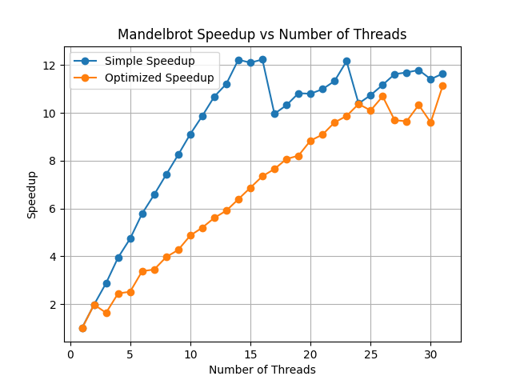

# prog1
在 AMD Ryzen 7 8745H 的8核16线程处理器上，使用了多线程技术来加速 Mandelbrot 集的计算。通过将计算任务分配给多个线程，我们能够显著减少计算时间。
## 实验结果

## 性能分析
1. 线程数小于等于处理器的核心数时，性能提升明显。随着线程数的增加，计算时间逐渐减少，但当线程数超过核心数时，性能提升趋于平缓，甚至可能出现性能下降。这是因为线程切换和资源竞争导致的开销增加。
2. simple 版本使用静态分块分配，负载不均，并行度有限；但是随着线程数增加，由于“瓶颈”线程的计算量减少，性能也得到提升。
3. Optimized 版本考虑了负载均衡，利用mandelbrot的点局部性特征，采用**静态交叉分配的方式实现负载均衡**，。
4. 该任务为计算密集型任务，优化方案聚焦于负载均衡，未考虑缓存命中率

